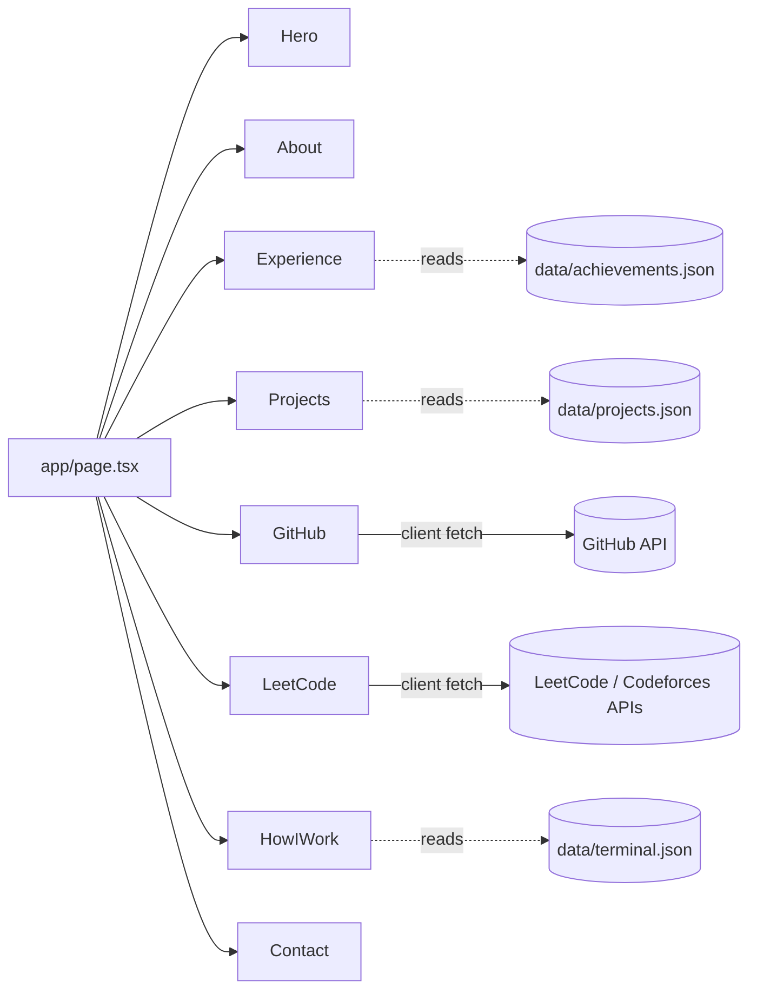

# Aditya Kumar — Portfolio

Personal developer portfolio built with Next.js 16 and a dark, cinematic editorial aesthetic. Live at **[adityakumar15.vercel.app](https://adityakumar15.vercel.app)**.


## Description

This is the source for my personal portfolio site — a single-page, section-based site that presents my projects, competitive programming stats, GitHub activity, and experience to recruiters and fellow developers. It's built to double as a live demonstration of front-end craft: custom cursor, scroll-driven interactions (GSAP), and a terminal-style "how I work" section, all on top of a dark, minimal visual system.

<!-- TODO: drop a screenshot or screen-recording GIF of the live site here -->
```

```
**Live demo:** [adityakumar15.vercel.app](https://adityakumar15.vercel.app)

## Table of Contents

- [Features](#features)
- [Tech Stack](#tech-stack)
- [Architecture](#architecture)
- [Prerequisites](#prerequisites)
- [Installation](#installation)
- [Configuration](#configuration)
- [Usage](#usage)
- [Project Structure](#project-structure)
- [Content Management](#content-management)
- [Deployment](#deployment)
- [Roadmap](#roadmap)
- [License](#license)
- [Acknowledgments](#acknowledgments)
- [Contact](#contact)

## Features

- **Live GitHub stats** — contribution calendar, streaks, and commit counts pulled client-side for `AdityaKumar1511`
- **Live competitive programming stats** — LeetCode (`Adi_2007`) and Codeforces (`aditya.kumar00706`) solve counts, ranks, and contest ratings
- **Interactive terminal panel** — a scripted `whoami` / `ls projects` / `cat <project>` style command list driven by `data/terminal.json`
- **Custom cursor** and GSAP-powered scroll interactions throughout
- **Section-based single-page layout** — Hero, About, Experience, Projects, GitHub, LeetCode, How I Work, Contact
- **Content-as-data** — projects, skills, achievements, and terminal copy are all driven by JSON files in `data/`, not hardcoded in components
- **Resume download** served directly from `/public/resume.pdf`
- Fully responsive, dark editorial theme with a consistent CSS custom-property color system

## Tech Stack

| Category | Technology |
|---|---|
| Framework | [Next.js 16](https://nextjs.org) (App Router) |
| UI | [React 19](https://react.dev) |
| Language | TypeScript |
| Styling | Tailwind CSS 4, custom CSS variables |
| Animation | [GSAP](https://gsap.com/) + `@gsap/react`, Framer Motion |
| 3D | `@splinetool/react-spline` |
| Icons | lucide-react |
| Fonts | Geist Sans / Geist Mono |
| Analytics | Vercel Analytics |
| Hosting | Vercel |

## Architecture

This is a single Next.js App Router app — no separate backend. Dynamic content (GitHub, LeetCode, Codeforces stats) is fetched client-side directly from public third-party APIs inside the respective components, with sensible fallback/mock values shown while loading.



Key decisions: content that's likely to change often (projects, skills, achievements, terminal copy) lives in `data/*.json` rather than JSX, so updates don't require touching component code. Third-party stats are fetched client-side (`'use client'` components) rather than server-side, trading a brief loading flash for zero server/API-key management.

## Prerequisites

- Node.js **18.18+** (required by Next.js 16)
- npm (or yarn / pnpm / bun — any Node package manager works)

## Installation

```bash
git clone https://github.com/AdityaKumar1511/portfolio_.git
cd portfolio_
npm install
```

## Configuration

No environment variables or API keys are required. GitHub, LeetCode, and Codeforces stats are pulled from public, unauthenticated endpoints at runtime in the browser.

If you fork this for your own use, update the hardcoded usernames before deploying:

| File | Variable | Purpose |
|---|---|---|
| `components/GitHub.tsx` | `USERNAME` | GitHub username for contribution stats |
| `components/LeetCode.tsx` | `LEETCODE_USERNAME` | LeetCode username for solve/contest stats |
| `components/LeetCode.tsx` | `CODEFORCES_USERNAME` | Codeforces handle for rating/rank stats |
| `data/meta.json` | — | Name, tagline, role, socials, resume path shown across the site |

## Usage

```bash
npm run dev
```

Open [http://localhost:3000](http://localhost:3000) to view the site. The page hot-reloads on edits to `app/page.tsx` or any component.

```bash
npm run build   # production build
npm run start   # serve the production build
npm run lint    # run ESLint
```

## Project Structure

```
portfolio_/
├── app/
│   ├── layout.tsx        # Root layout, fonts, metadata/OG tags
│   ├── page.tsx           # Assembles all page sections
│   └── globals.css        # Design tokens (dark theme CSS variables) + base styles
├── components/
│   ├── Hero.tsx            # Landing section
│   ├── About.tsx           # Bio section
│   ├── Experience.tsx      # Experience timeline
│   ├── Projects.tsx        # Project cards, reads data/projects.json
│   ├── GitHub.tsx          # Live GitHub contribution stats
│   ├── LeetCode.tsx        # Live LeetCode + Codeforces stats
│   ├── HowIWork.tsx         # Terminal-style workflow section
│   ├── Contact.tsx          # Contact section
│   ├── Navbar.tsx / Footer.tsx / Ticker.tsx / CustomCursor.tsx
├── data/
│   ├── meta.json            # Name, tagline, socials, resume path
│   ├── projects.json        # Project list (name, tech, links, impact)
│   ├── skills.json          # Skills grouped by category
│   ├── achievements.json    # Hackathons, competitive programming, open source
│   └── terminal.json        # Commands/output for the terminal section
├── lib/utils.ts             # Shared utilities (className merging, etc.)
├── types/index.ts           # Shared TypeScript types
└── public/                  # Static assets (resume.pdf, profile.png, robots.txt)
```

## Content Management

To update the site's content without touching component code, edit:
- **Projects** → `data/projects.json` (add/remove entries; `featured: true` controls prominent placement)
- **Skills** → `data/skills.json`
- **Achievements / hackathons / CP stats** → `data/achievements.json`
- **Terminal commands** → `data/terminal.json`
- **Bio / socials / resume link** → `data/meta.json`

## Deployment

Deployed on **Vercel**, auto-building from the `main` branch. To deploy your own copy:

```bash
npm i -g vercel
vercel
```

Or connect the repo directly at [vercel.com/new](https://vercel.com/new) — no environment variables are required for a default deploy.

## Roadmap

<!-- TODO: fill in from your own backlog -->
- [ ] Fix `og:url` / `og:image` metadata for link previews
- [ ] Run `depcheck` and remove unused dependencies
- [ ] Add `robots.ts` and `sitemap.ts`
- [ ] Move to a custom domain

## License

MIT — see [LICENSE](./LICENSE).

## Acknowledgments

- [Next.js](https://nextjs.org) — application framework
- [GSAP](https://gsap.com/) — scroll and motion animation
- [Spline](https://spline.design/) — 3D visuals
- [Geist](https://vercel.com/font) — typography
- [Tailwind CSS](https://tailwindcss.com/) — styling

## Contact

**Aditya Kumar**
[GitHub](https://github.com/AdityaKumar1511) · [LinkedIn](https://linkedin.com/in/aditya-kumar-57a988374/) · aditya.kumar00706@gmail.com
